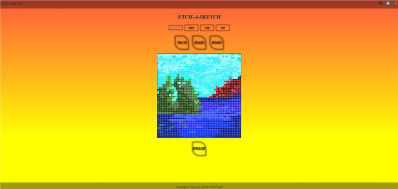

# etch-a-sketch

A digital incarnation of the classic toy.

Live preview of etch-a-sketch application:
[etch-a-sketch](https://sdooodly.github.io/etch-a-sketch/)


Use the command below to clone this repo! 
```bash
git clone https://github.com/sdooodly/etch-a-sketch.git
```

Clone repo supporting this repo:
[eas-clone](https://github.com/sdooodly/eas-clone)

Toodles! (:
## Credits

Photo by [Bence Balla-Schottner](https://unsplash.com/fr/@ballaschottner?utm_source=unsplash&utm_medium=referral&utm_content=creditCopyText) on [Unsplash](https://unsplash.com/photos/9duHH_ZLCs4?utm_source=unsplash&utm_medium=referral&utm_content=creditCopyText)


## Logs
### 30/04/2023
#### To-Do
- There should be default no of squares
- Why are some squares going out? Unable to divide?
- Align menu
- Randomize warm, cool and noir
- Colour picker is so basic. Use the normal hex
- Colour should change on prolonged click, not just new clicks
- Refactor!!!

### 04/05/2023
#### Note
- Colour checker, wrto browser, silly

### 07/05/2023
#### Change log
- Changed the whole lot, taken from eas-clone branch: https://github.com/sdooodly/eas-clone
#### To-Do
- Default number of grids should be present
- Automate colour generation with a function
- Random colour for every new square

### 07/05/2023
#### Change log
- Change screenshot cus Itachi's sharingan is wrong :/


